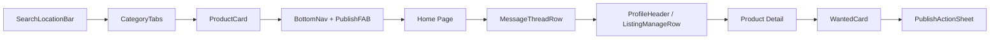
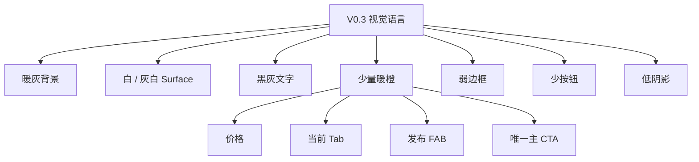

# 社区闲置小程序｜React/Taro 原型辅助包 V0.3

本包用于 `codex/community-visual` 的第一轮本地 React/Taro 组件搭建。

## 已冻结

- 五栏导航：`闲置｜求购｜＋发布｜消息｜我的`
- 中央 `＋发布` 为唯一强强调一级动作。
- 统一亮色：`#FF7433`
- 页面基调：暖灰高级感，橙色只用于价格、当前 Tab、发布 FAB、关键动作。
- 删除“免费送”分类。
- 首页仍以双列闲置商品为主。
- 商品卡保留：图片、标题、价格、卖家头像、昵称、小区、距离、轻量“问问卖家”。
- 消息是“商品会话”，不是社交联系人；列表点击直接进入聊天。
- 联系方式交换仅在聊天内处理。
- 小程序不承担支付、担保、物流。
- `我的` 是轻管理页，不做电商式个人中心。

## 4 张视觉参考

1. `references/01_home_v0.3.png`
2. `references/02_messages_v0.3.png`
3. `references/03_profile_v0.3.png`
4. `references/04_product_detail_v0.3.png`

视觉参考用于约束结构与层级，不要求像素级照抄。

## 组件搭建优先级



## 视觉原则



### 不要带回

- 大面积橙色渐变
- 厚重白卡 + 明显浮层阴影
- 每个分类都做大胶囊
- 一屏多个橙色大按钮
- 免费送一级分类
- 消息列表里的大“同意交换”按钮
- 电商式购物车/订单/评分/折扣语言


---

# V0.4 新增

新增发布闭环专项：

- `06_PUBLISH_FLOW_v0.4.md`
- `07_NEXT_CORE_DISCUSSIONS_v0.4.md`

新增视觉参考：

- `references/05_publish_form_v0.4.png`
- `references/06_location_picker_v0.4.png`
- `references/07_publish_success_share_v0.4.png`

V0.4 关键覆盖：

```text
删除独立交易设置页
删除发布时曝光半径
删除发布时联系方式配置

改为：

一屏发布
→ 必要时选择社区
→ 发布成功
→ 分享到社区群
```


---

# V0.5 新增｜9 张关键界面已纳入辅助文档

本轮把“刚才的 6 张”与“本轮新增 3 张”合并，形成 **9 张关键界面参考**，并新增产品经理视角说明文档：

- `08_NINE_SCREENS_PM_NOTES_v0.5.md`

新增 9 张参考图：

1. `references/08_wanted_list_v0.5.png`
2. `references/09_wanted_publish_v0.5.png`
3. `references/10_private_chat_v0.5.png`
4. `references/11_contact_exchange_sheet_v0.5.png`
5. `references/12_wechat_group_share_v0.5.png`
6. `references/13_profile_lifecycle_v0.5.png`
7. `references/14_publish_success_share_v0.5.png`
8. `references/15_sell_publish_form_v0.5.png`
9. `references/16_location_picker_light_v0.5.png`

这些界面现在覆盖了两个最核心闭环：

- **出闲置闭环**：发布闲置 → 位置选择 → 发布成功 → 群分享 → 商品聊天 → 联系方式交换 → 我的/已出管理
- **求购闭环**：求购列表 → 发布求购 → 卖家响应

V0.5 的新增冻结点：

- 社区身份先不做强体系化认证，只保留轻量社区归属展示。
- `我的` 页必须支持 **橙色“标记已出”**，形成全生命周期管理闭环。
- 微信群分享卡不是装饰，而是冷启动核心入口。
- 商品聊天页必须是 **聊天优先**，不能退化成“消息列表里的商品详情卡”。
- 联系方式交换只在聊天场景里触发，不在列表页大面积暴露。


---

# V0.6 新增｜组件级高保真复刻

新增：

- `09_CODEX_COMPONENT_REPLICATION_TASKS_v0.6.md`
- `10_CODEX_V0.6_START_PROMPT.md`

V0.6 不再允许 Codex 按页面自由发挥。

执行方式改为：

```text
原型图
→ 单组件复刻
→ /components-preview
→ 390×844 对照验收
→ MATCHED
→ 页面组装
```

第一轮只重做：

1. SearchLocationBar
2. CategoryTabs
3. ProductCard
4. WantedCard
5. BottomNav + PublishFAB
6. ListingManageRow
