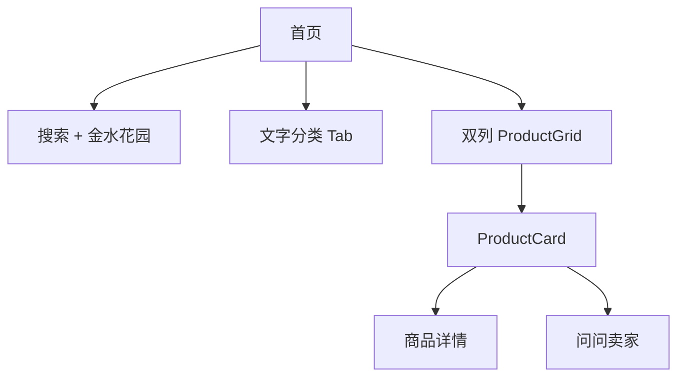
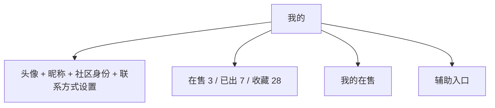
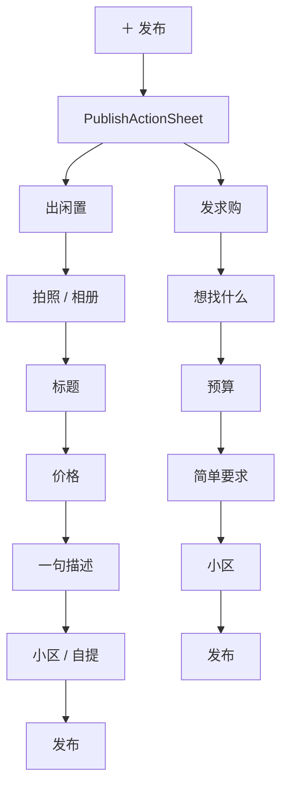

# 01｜产品与页面基线 V0.3

## 1. 核心产品关系


小程序只补微信群中间缺失的“结构化商品 + 意向沟通”。

---

## 2. 一级导航

```text
闲置     求购        ＋       消息      我的
                    发布
```

### 导航职责

- `闲置`：卖方供给。
- `求购`：买方需求。
- `发布`：统一供需入口。
- `消息`：围绕商品的会话。
- `我的`：个人闲置和基础设置。

### 发布 FAB

- 居中
- 58px 左右
- 上浮约 8px
- `#FF7433`
- 点击后不是直接进复杂发布中心，而是弹：
  - 出闲置
  - 发求购

---

## 3. 页面结构

### 3.1 闲置首页



首页卡片优先级：

1. 图片
2. 标题
3. 价格
4. 卖家头像 / 昵称
5. 小区 / 距离
6. 轻量联系动作

分类固定：

`全部 / 家具 / 家电 / 数码 / 母婴 / 图书 / 其他`

---

### 3.2 求购页

不要复刻商品双列网格。

采用紧凑需求列表：

```text
[头像] 小橘子
求一个小书桌
预算 ¥50–100
金水花园 · 今天
                          我有这个 >
```

`我有这个` 点击直接进入与求购者的会话入口。

---

### 3.3 消息

列表是“商品会话 Row”，不是商品详情卡。

```text
[商品缩略图]  小橘子                    18:36
              宜家书桌 · ¥50
              请问书桌还在吗？          ●
```

- 点击整行进入聊天。
- `待处理 / 已交换联系方式` 仅用小状态文字。
- 不在列表直接处理联系方式申请。
- 不重复展示每一行的社区位置。

---

### 3.4 我的



`我的在售` 是管理列表，不是个人店铺橱窗。

每行：

- 缩略图
- 标题
- 价格
- 浏览 / 收藏 / 更新时间
- 小号文字 `标记已出`

---

### 3.5 商品详情

结构顺序：

1. 返回 / 收藏 / 分享
2. 大图
3. 商品名 / 价格
4. 卖家卡：头像 / 昵称 / 社区身份 / 小区距离
5. 简短描述
6. 成色 / 自提 / 可取时间 / 发布时间
7. 快速提问
8. 底部固定：收藏 + `问问卖家`

详情页不做：

- 购物车
- 立即购买
- 平台支付
- 运费模板
- 店铺入口
- 推荐瀑布流首屏干扰

---

## 4. 发布


