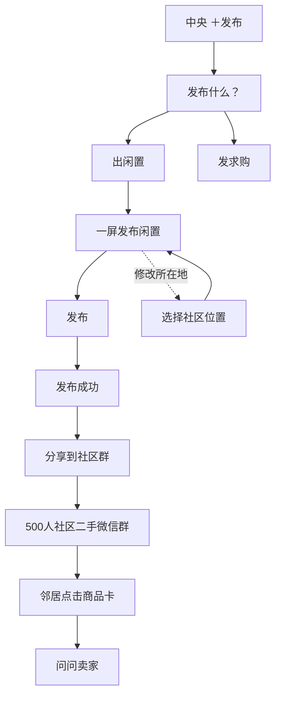
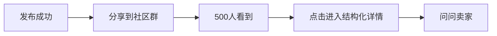

# 06｜发布闭环 V0.4：一屏发布 + 社区位置 + 群分享

> 本文覆盖 V0.3 中较重的“多步发布 / 交易设置”设想。
> V0.4 原则：**一屏完成核心发布；只有修改位置时进入地图；发布成功后优先回到社区微信群。**

视觉参考：

- `references/05_publish_form_v0.4.png`
- `references/06_location_picker_v0.4.png`
- `references/07_publish_success_share_v0.4.png`

---

## 1. 产品目标

发布不是“填写一份二手交易表单”，而是：

> **让用户在 30～60 秒内，把一个真实闲置放进社区商品池，并能马上分享到已有社区二手群。**

第一阶段只解决：

1. 真实照片
2. 商品是什么
3. 卖多少钱
4. 属于什么基础分类
5. 大概成色
6. 在哪个社区自提
7. 发布并分享

不解决：

- 平台支付
- 物流
- 配送
- 运费
- 曝光半径
- 复杂预约
- 发布时联系方式配置
- 订单
- 担保交易
- 复杂交易设置

---

# 2. 最终发布闭环



核心变化：

> 原“发布闲置 → 选择位置 → 交易设置 → 确认发布”
> 收敛为
> **“一屏发布 →（必要时选社区）→ 发布成功 → 分享到群”**

---

# 3. 一屏发布页

## 3.1 页面结构

```text
发布闲置

先上传真实照片，更容易卖出

[图1] [图2] [图3] [＋]

标题        宜家书桌                 4/30
────────────────────────────────
价格        ¥50              参考同类价格 >
────────────────────────────────
分类        家具   家电   图书   数码   其他
────────────────────────────────
成色                                  9成新 >
────────────────────────────────
补充描述（选填）
宜家书桌，实用简约风……
                                      48/500
────────────────────────────────
所在地                              金水花园 >

[                 发布                 ]
```

---

## 3.2 必填与选填

### 真正必填

- 至少 1 张真实图片
- 标题
- 价格
- 所在社区

### 系统建议 / 轻选择

- 分类
- 成色

### 选填

- 补充描述

目标：

> 不允许“为了完整”继续加表单字段。

---

# 4. 图片上传

第一阶段建议：

- 1～9 张
- 首图即商品封面
- 可删除
- 可调整首图
- 裁剪放 P1，不作为首次开发重点

页面上先展示 3 张真实图片 + 1 个添加入口，保持首屏紧凑。

不要：

- 上传视频
- 图片滤镜
- 图片模板
- AI 修图
- 复杂水印

---

# 5. 分类

固定轻量分类：

```text
家具 / 家电 / 图书 / 数码 / 母婴 / 其他
```

视觉：

- 不使用大胶囊
- 选中项用暖橙文字 + 短 underline
- 未选灰色文字

后续如果做图片识别，可自动预选分类，但不能阻塞发布。

---

# 6. 成色

不在主页面铺开一整排按钮。

主页面仅显示：

```text
成色                            9成新 >
```

点击后用轻 Bottom Sheet：

```text
全新
9成新
8成新
7成新及以下
```

只解决“快速选一个大致状态”。

---

# 7. 所在地 / 地图组件

## 7.1 产品定义

地图页不是：

> 设置曝光范围。

地图页只解决：

> **这件商品在哪个社区自提？**

因此删除：

- 本社区
- 500m
- 1km
- 3km

这些范围配置。

---

## 7.2 技术边界

直接使用：

> **微信小程序原生 Map / 腾讯位置服务能力**

产品只调用最少能力：


不做：

- 自研地图
- 复杂圈选
- 绘制交易半径
- 轨迹
- 路径规划
- 多 Marker 商业地图

---

## 7.3 位置隐私

商品公开位置必须是：

> **社区级 / 小区级模糊位置**

例如：

```text
金水花园
金水花园二期
金水花园南区
```

商品页可以显示：

```text
金水花园 · 320m
```

不要公开：

- 楼栋
- 单元
- 房号
- 精确住宅坐标

精确面交点由交易双方后续私聊确认。

---

## 7.4 LocationPicker 页面

```text
选择位置

[ 搜索小区 / 社区 ]

        腾讯原生地图

            📍
          金水花园

────────────────
📍 金水花园
仅显示大致位置，保护你的隐私安全

仅展示社区级位置，不显示具体门牌

[             确认位置             ]
```

### 交互

1. 进入页面默认定位当前区域。
2. 自动给出附近社区候选。
3. 用户大多数情况下只需确认。
4. 只有识别错误时才搜索 / 拖动地图重新选社区。
5. 确认后立即返回发布页。

---

# 8. 交易设置页删除

V0.4 不保留独立 `交易设置` 页面。

以下内容统一删除或降级：

### 取货方式

第一阶段产品规则就是：

> **社区自提优先 / 默认自提**

无需每次发布选择。

### 联系方式

属于账户 + 会话层，不属于发布层。

流程：

```text
小程序聊天
→ 买家申请交换联系方式
→ 卖家同意
→ 才展示 ContactCard
```

发布商品时不配置。

### 可取时间

不是 MVP 必填。

第一阶段直接通过：

> “今天方便拿吗？”

这类快捷问句沟通。

如果后续验证高频需要，再作为 P1 增加：

```text
可取时间（选填）     今晚 >
```

---

# 9. 发布成功页

发布成功不是普通完成反馈，它承担：

> **把结构化商品重新分发回已有社区微信群。**

页面结构：

```text
发布成功

✓

已成功发布
你的闲置已进入社区商品池

[商品预览]
宜家书桌
¥50
金水花园

分享预览
[微信小程序商品卡]

[          分享到社区群          ]

稍后再说
```

---

# 10. 商品分享卡

分享卡必须做到：

> 群成员不点开，也能在 2～3 秒内知道“是什么、多少钱”。

建议内容：

```text
[商品主图]

宜家书桌

¥50

金水花园 · 点击查看
```

不要加入：

- 长描述
- 会员
- 浏览数
- 点赞
- 店铺
- 多个标签
- 商业广告文案

---

# 11. 发布成功后的核心 CTA

唯一主 CTA：

> **分享到社区群**

次级：

> 稍后再说

原因：



这比增加复杂交易设置，更直接解决产品核心痛点。

---

# 12. ProductDraft 建议

```ts
type ProductDraft = {
  images: string[]
  title: string
  price: number

  categoryId?: string
  condition?: 'new' | 'like_new' | 'good' | 'used'

  description?: string

  communityId: string
  communityName: string

  // 仅用于内部社区级定位，不直接公开精确住宅位置
  latitude?: number
  longitude?: number
}
```

暂不增加：

```text
deliveryType
shippingFee
paymentMethod
tradeMethod
exposureRadius
sellerContactMethod
appointmentPolicy
```

---

# 13. V0.4 开发验收

## 发布

- [ ] 一屏完成主要字段
- [ ] 页面无独立交易设置入口
- [ ] 至少一张图即可发布
- [ ] 标题 / 价格层级清晰
- [ ] 分类为轻 Tab
- [ ] 成色为单行选择
- [ ] 描述明确标注选填
- [ ] 所在地默认当前社区
- [ ] 只在修改所在地时进入 LocationPicker

## 地图

- [ ] 使用原生 Map / 腾讯位置服务
- [ ] 只解决社区 POI 选择
- [ ] 无曝光半径选择
- [ ] 不展示精确住宅门牌
- [ ] 确认后一键返回发布页

## 发布成功

- [ ] 商品进入社区商品池
- [ ] 展示分享卡预览
- [ ] `分享到社区群` 是唯一主 CTA
- [ ] 可稍后再说
