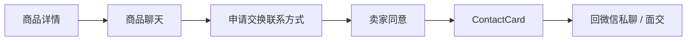
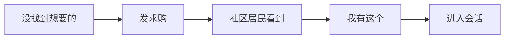
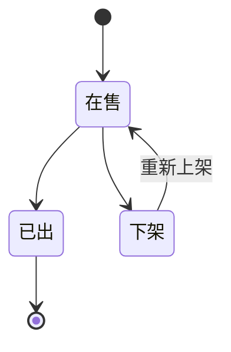
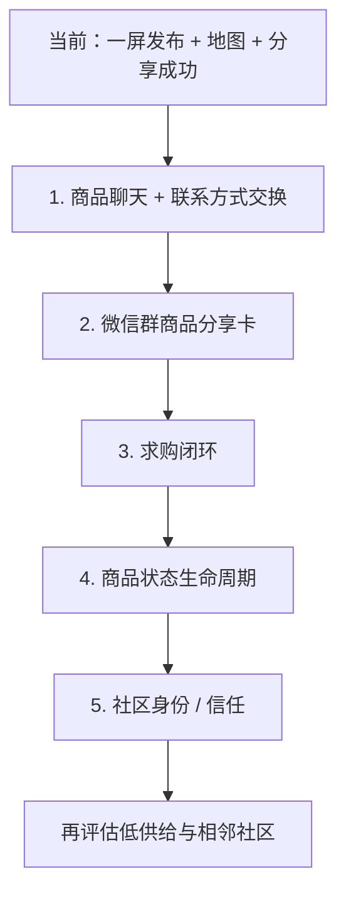

# 07｜后续必须单独讨论的核心开发问题

> 原则：只讨论**直接影响“社区闲置更容易找到、更容易联系、更容易成交”**的能力。
> 暂不扩展普通平台功能。

---

# P0-1｜商品聊天页 + 联系方式交换

这是当前最优先的下一轮。

原因：

> 首页和详情解决“找到商品”，但真正决定成交的是“能不能快速问、快速建立下一步联系”。

需要单独冻结：



需要讨论：

1. 聊天顶部商品挂件长什么样
2. 第一次进入默认快捷问句
3. 买家何时出现“申请交换联系方式”
4. 卖家收到申请后的 UI
5. 同意后如何展示联系方式
6. 商品已出后会话如何处理

第一阶段不做：

- 语音
- 视频
- 文件
- 群聊
- 红包
- 位置共享
- 好友系统

---

# P0-2｜微信群商品分享卡

这是产品区别于普通二手 App 的核心增长闭环。

必须单独确认：

```text
卖家发布
→ 生成分享卡
→ 分享到现有500人群
→ 群成员快速判断
→ 点击商品详情
```

需要讨论：

1. 分享标题最终文案
2. 分享图片 / 封面生成方式
3. 商品已出后，旧分享卡点进去看到什么
4. 分享卡是否展示小区
5. 分享成功后的回流体验

核心目标：

> 群里三秒看懂，不点开也知道商品是什么、多少钱。

---

# P0-3｜求购页 + 发求购

社区供给一定比全国平台少。

求购解决：

> “当前没找到，但我确实需要。”

需要单独设计：



需要讨论：

1. 求购卡信息结构
2. 预算是否必填
3. 是否需要图片
4. “我有这个”如何进入聊天
5. 求购发布多久自动过期

不要把求购做成第二套商城。

---

# P0-4｜商品状态生命周期

微信群最大痛点之一：

> 信息发出来后，不知道还在不在。

因此商品状态必须比传统群聊更清楚。

最小状态：



需要讨论：

1. `标记已出` 放哪里
2. 是否支持恢复在售
3. 已出商品详情怎么展示
4. 已出商品分享卡如何处理
5. 长时间未更新是否提示卖家确认

第一阶段不要做复杂订单状态。

---

# P0-5｜社区身份 / 信任最低机制

这个产品建立在：

> “这是我们社区里的个人闲置”

而不是全国陌生商家。

因此至少要讨论：

1. 用户如何标记“金水花园住户”
2. 社区身份是否需要人工 / 群内邀请码 / 简单验证
3. 商品发布时社区是否默认绑定
4. 如何举报明显商家 / 批量同款
5. 用户隐私公开到什么程度

目标：

> 最低限度证明“这是本地个人用户”，不要第一阶段做复杂信用分。

---

# P1｜低供给 / 空状态

等前五项跑通以后，再讨论。

需要解决：

> 用户打开后商品不够时怎么办。

轻量方案：

- 展示求购入口
- 扩展到相邻社区
- 提示“最近新发布”
- 不做复杂推荐算法

---

# 暂缓讨论

以下内容当前不是核心痛点，先不投入：

```text
平台支付
担保交易
物流
配送
积分
金币
会员
店铺
社区论坛
关注/粉丝
短视频
直播
复杂评价体系
AI砍价
AI客服
复杂推荐算法
复杂地图功能
交易订单中心
```

---

# 推荐内部开发讨论顺序



如果前五项跑通，MVP 的核心价值闭环已经完整。
