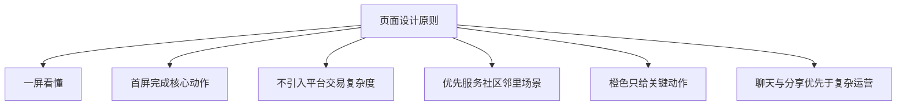
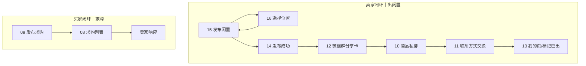
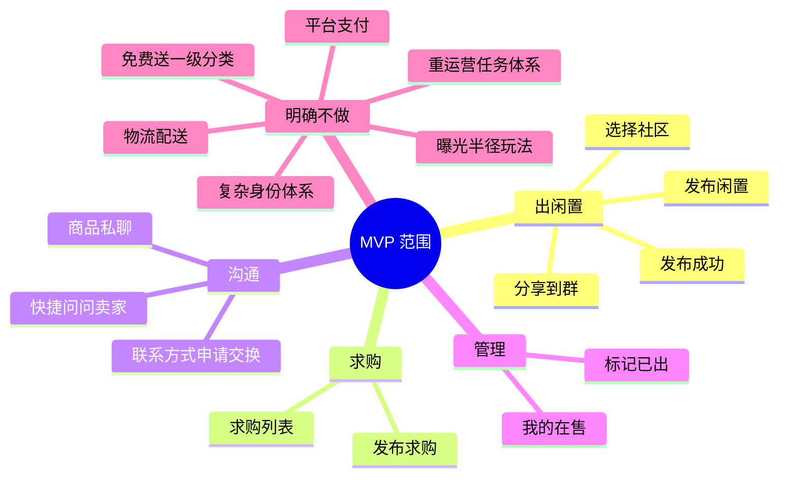

# 08｜九张关键界面 PM 说明 V0.5

> 目的：把当前 9 张原型图正式纳入设计原型辅助文档，统一为开发、设计、产品三方的同一口径。
> 视角：**产品经理视角**，强调“页面存在的业务意义、解决什么痛点、保留什么、砍掉什么”。

---

## 0. 为什么要把这 9 张图合并成一套

现在不是单独做几个漂亮页面，而是在搭一个 **社区闲置小程序的最小可用闭环**。

这 9 张图覆盖了两条最核心路径：

1. **卖家路径（出闲置）**
   发布闲置 → 选择社区 → 发布成功 → 分享到微信群 → 买家点开 → 聊天沟通 → 申请交换联系方式 → 卖家标记已出。

2. **买家路径（求购）**
   浏览求购 → 发布求购 → 卖家响应。

所以这 9 张图不是“散页”，而是 **MVP 业务骨架**。

---

## 1. 九张图总览

| 编号 | 文件 | 页面名称 | 角色 | 所属闭环 |
|---|---|---|---|---|
| 1 | `references/08_wanted_list_v0.5.png` | 求购列表页 | 买家/卖家 | 求购闭环 |
| 2 | `references/09_wanted_publish_v0.5.png` | 发布求购页 | 买家 | 求购闭环 |
| 3 | `references/10_private_chat_v0.5.png` | 商品私聊页 | 买家/卖家 | 交易沟通 |
| 4 | `references/11_contact_exchange_sheet_v0.5.png` | 联系方式交换弹窗 | 买家/卖家 | 交易转私域 |
| 5 | `references/12_wechat_group_share_v0.5.png` | 微信群分享卡效果页 | 群成员 | 冷启动/扩散 |
| 6 | `references/13_profile_lifecycle_v0.5.png` | 我的页（带已出管理） | 卖家 | 生命周期管理 |
| 7 | `references/14_publish_success_share_v0.5.png` | 发布成功页 | 卖家 | 发布闭环 |
| 8 | `references/15_sell_publish_form_v0.5.png` | 发布闲置页 | 卖家 | 发布闭环 |
| 9 | `references/16_location_picker_light_v0.5.png` | 选择位置页 | 卖家 | 发布闭环 |

---

## 2. 总体产品判断

### 2.1 当前产品最重要的不是“功能多”

最重要的是：

- 社区用户愿不愿意快速发布
- 群里的人能不能快速看到
- 感兴趣的人能不能快速问
- 双方能不能顺畅转到更深沟通
- 卖家能不能轻松完成“已卖出”管理

### 2.2 因此，页面设计原则必须统一

---

## 3. 九张图对应的业务闭环

---

# 4. 页面逐张 PM 说明

---

## 页面 1｜求购列表页

**文件**：`references/08_wanted_list_v0.5.png`

### 页面目标

让社区里“有需求但暂时没找到货”的人，可以直接发需求；也让“我正好有这个”的邻居快速响应。

### 解决的痛点

- 闲置交易不是只有“卖”，还有“找不到想买的”
- 群聊里发求购容易被淹没，没有沉淀
- 卖家不知道社区里真实需求是什么

### 页面定位

它不是电商“需求广场”，而是：

> **社区内的轻量求购清单**。

### 必须保留

- 搜索
- 轻分类
- 预算区间
- 需求标题
- 简短补充说明
- 社区归属
- 右侧 **“我有这个”** 快速响应动作

### 不要做

- 求购长帖
- 复杂议价机制
- 平台抢单
- 复杂曝光排序系统

### 产品建议

“我有这个”点击后，优先进入商品匹配或聊天，而不是再跳复杂中间页。

---

## 页面 2｜发布求购页

**文件**：`references/09_wanted_publish_v0.5.png`

### 页面目标

让用户在 30 秒左右发出一个明确、简短、可被邻居理解的求购需求。

### 核心字段

- 标题
- 预算
- 分类
- 补充要求（选填）
- 参考图片（选填）
- 所在地

### PM 判断

求购页应该比“发布闲置”更轻，因为它天然没有大量商品图片和成色描述。

### 必须保留

- 标题
- 预算
- 所在地

### 可以是轻量项

- 分类
- 补充要求
- 参考图片

### 不要做

- 期望交易时间复杂配置
- 复杂求购标签体系
- 悬赏、竞价、押金等电商化玩法

---

## 页面 3｜商品私聊页

**文件**：`references/10_private_chat_v0.5.png`

### 页面目标

这是交易真正发生的地方。

用户在这里确认：

- 东西还在不在
- 今晚能不能拿
- 价格还能不能聊
- 怎么见面

### 页面定位

> 这是“商品会话页”，不是普通 IM，也不是商品详情页。

### 必须保留

- 顶部商品卡（明确正在聊哪件商品）
- 真实聊天气泡
- 快捷提问
- 输入框
- 底部 **申请交换联系方式**

### 为什么重要

你前面已经判断过，消息页不能还是商品卡思路，而是要像微信那样点进来就能马上看到对话。

这张图正好把这个设计方向固定下来。

### 不要做

- 聊天页塞太多商品运营模块
- 聊天页里放支付、物流、订单系统
- 联系方式直接裸露展示

---

## 页面 4｜联系方式交换弹窗

**文件**：`references/11_contact_exchange_sheet_v0.5.png`

### 页面目标

在小程序能力受限的情况下，为交易双方提供一个 **有确认动作的联系方式交换机制**。

### 业务意义

这相当于你前面提出的：

> 像 Soul 一样，先申请，再同意，才交换联系方式。

### 为什么不能直接展示

- 避免联系方式被随意爬取
- 避免用户没有沟通就被打扰
- 保持平台内先沟通，再转私域

### 必须保留

- 明确提示“对方希望交换联系方式”
- 展示将要交换的联系方式类型
- 两个动作：**暂不同意 / 同意交换**

### 不要做

- 默认直接暴露微信号
- 列表页直接出现大面积“同意交换”按钮
- 一上来就让用户出手机号

---

## 页面 5｜微信群分享卡效果页

**文件**：`references/12_wechat_group_share_v0.5.png`

### 页面目标

把“社区微信群 500 人”这个现实资源，真正变成产品冷启动入口。

### 这张图的意义非常大

因为你这个产品不是从 0 流量平台开始，而是：

> **一个社区 + 一个现成二手微信群 + 一个轻小程序。**

所以群分享卡不是附加功能，而是 **MVP 的核心增长动作**。

### 分享卡必须传达的信息

- 这是社区闲置，不是外部广告
- 是什么商品
- 卖多少钱
- 来自哪个社区
- 点一下可进小程序查看

### PM 冻结

分享卡需要优先走微信小程序原生分享能力，不做自定义复杂海报生成器作为第一期重点。

---

## 页面 6｜我的页（带已出管理）

**文件**：`references/13_profile_lifecycle_v0.5.png`

### 页面目标

让卖家在一个轻页面里完成自己的交易生命周期管理。

### 页面定位

它不是“超级个人中心”，而是：

> **轻量管理台**。

### 最关键的地方

就是你强调的：

> 在“我的在售”里，能够快速点 **橙色“标记已出”**。

这件事非常关键，因为这决定商品池能不能保持新鲜，避免卖掉的商品继续挂着。

### 必须保留

- 在售 / 已出 / 收藏
- 我的在售列表
- **标记已出** 强动作
- 少量必要入口：我发布的闲置、浏览记录、帮助反馈、社区规则、关于我们

### 先不要做

- 社区身份认证体系（你已明确“先不管”）
- 等级体系
- 积分、勋章、任务
- 复杂钱包系统

---

## 页面 7｜发布成功页

**文件**：`references/14_publish_success_share_v0.5.png`

### 页面目标

用户发布完，不是结束，而是进入第二个动作：

> **分享给社区群，让邻居立刻看到。**

### 为什么不能只给“完成”

如果只给“发布成功”，很多人就退出了；但你这个产品最强的传播渠道本来就是群。

所以发布成功页应该承担：

- 给用户正反馈
- 给用户一个明确的下一步
- 告诉他“分享后更容易被看到”

### 必须保留

- 发布成功反馈
- 商品卡预览
- 分享卡预览
- 主 CTA：**分享到社区群**
- 次 CTA：稍后再说

---

## 页面 8｜发布闲置页

**文件**：`references/15_sell_publish_form_v0.5.png`

### 页面目标

让卖家用最低成本完成一次有效发布。

### 当前方向是对的

这一版已经比较符合你强调的：

- 轻量
- 一屏放下
- 必填少
- 不做多步复杂发布

### 第一阶段核心字段

- 图片
- 标题
- 价格
- 分类
- 成色
- 补充描述（选填）
- 所在地

### PM 判断

这页要服务“快速卖掉”，不是服务“填写完整档案”。

### 不要做

- 交易设置独立大页
- 配送/运费
- 曝光半径设置
- 多段预约配置
- 支付方式配置

---

## 页面 9｜选择位置页

**文件**：`references/16_location_picker_light_v0.5.png`

### 页面目标

只做一件事：

> **确认这件商品属于哪个社区/小区。**

### 这里最重要的产品判断

地图页不是为了展示能力，不是为了做复杂 LBS，它只是发布流程中的一个轻步骤。

### 你当前的收敛方向是正确的

应该保留：

- 搜索小区/社区
- 原生腾讯地图
- 当前社区锚点
- 轻隐私提示
- 一个主按钮：确认位置

### 应该砍掉

- 500m / 1km / 3km 多范围选择
- 复杂交易半径逻辑
- 自绘圈选
- 路径规划
- 多层地图操作

### PM 结论

只显示 **社区级位置**，不显示具体门牌，是最适合这个场景的。

---

# 5. 这 9 张图共同冻结的 MVP 范围

---

# 6. 后续最值得单独继续讨论的点

## P0（最影响首版闭环）

1. **商品详情页最终结构**
   详情页和聊天页之间的关系还要继续收敛。

2. **群分享卡文案与样式规则**
   哪些字段必须展示，哪些字段可省略。

3. **消息列表页与聊天页的状态关系**
   什么状态显示“沟通中 / 已交换联系方式 / 已成交”。

4. **标记已出之后的联动逻辑**
   商品池、聊天页、消息列表要怎么联动更新。

## P1（次阶段）

5. **求购与闲置的互相匹配机制**
   后续可做“你发布的商品可能匹配这些求购”。

6. **发布表单智能辅助**
   比如图像识别分类、价格建议。

7. **社区规则与信任机制**
   先不做身份体系，但规则提示和轻信任表达要有。

---

# 7. 给设计师与开发的最终一句话

这 9 张图已经足够支撑第一版原型实现。

接下来不要继续往“功能更全”发散，而应该围绕这两件事推进：

1. **把发布—分享—聊天—交换联系方式—已出管理这个闭环做通**
2. **把求购作为第二条轻路径补齐，但不要做重**

也就是说：

> 第一版不是做一个“小闲鱼”，而是做一个 **依托社区微信群的轻量闲置交易工具**。
