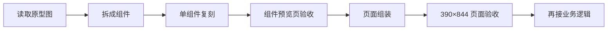
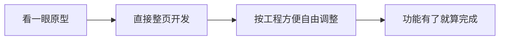
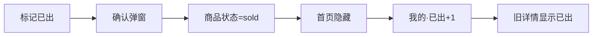

# 09｜Codex 组件复刻任务单 V0.6

> 目标：把当前 React + Taro 实现从“参考原型自由发挥”切换为 **组件级高保真复刻**。
> 原则：**先组件、后页面；先视觉一致、后业务接线；原型图优先于现有 H5 视觉。**

---

# 0. 本轮任务定义

当前 Codex 实现的问题不是“功能没有做出来”，而是：

> **组件结构、尺寸关系、留白、视觉层级和原型图不一致。**

因此从 V0.6 开始，禁止继续按“整页自由实现”的方式推进。

## 0.1 唯一正确的实现路径



## 0.2 禁止路径



---

# 1. 视觉 Source of Truth

## 1.1 最新 13 张主参考图

以下为当前 **最高优先级视觉基线**：

| 编号 | 文件 | 页面 |
|---|---|---|
| P01 | `references/01_home_v0.3.png` | 闲置首页 |
| P02 | `references/02_messages_v0.3.png` | 消息列表 |
| P03 | `references/04_product_detail_v0.3.png` | 商品详情 |
| P04 | `references/08_wanted_list_v0.5.png` | 求购列表 |
| P05 | `references/09_wanted_publish_v0.5.png` | 发布求购 |
| P06 | `references/10_private_chat_v0.5.png` | 商品私聊 |
| P07 | `references/11_contact_exchange_sheet_v0.5.png` | 联系方式交换 |
| P08 | `references/12_wechat_group_share_v0.5.png` | 微信群分享卡效果 |
| P09 | `references/13_profile_lifecycle_v0.5.png` | 我的 / 商品生命周期 |
| P10 | `references/14_publish_success_share_v0.5.png` | 发布成功 / 群分享 |
| P11 | `references/15_sell_publish_form_v0.5.png` | 发布闲置 |
| P12 | `references/16_location_picker_light_v0.5.png` | 位置选择 |
| P13 | `references/03_profile_v0.3.png` | 我的页早期结构辅助参考 |

> P09 为“我的页”最新主基线，P13 只用于补充结构，不得覆盖 P09。

## 1.2 次级参考

以下旧图仅用于理解早期思路，不再作为像素级主基线：

- `references/05_publish_form_v0.4.png`
- `references/06_location_picker_v0.4.png`
- `references/07_publish_success_share_v0.4.png`

## 1.3 优先级冲突规则

如果视觉要求冲突：

```text
最新主参考图
>
本文组件任务单
>
UI Token
>
旧原型图
>
当前 H5 / 当前 React 实现
```

**当前 H5 不能反向成为视觉基准。**

---

# 2. 总体高保真规则

## 2.1 固定验收视口

H5 Review 固定：

```text
390 × 844
```

所有组件需要先在该视口下检查。

## 2.2 视觉基调

统一：

```text
页面背景      #F5F5F3 / 暖灰白
Surface       #FAFAF8 / #FFFFFF
主文字        #222222
次文字        #777773
弱文字        #A3A39E
边界          #E8E7E3
品牌橙        #FF7433
浅橙          #FFF1E8
```

### 橙色只能重点使用在

- 价格
- 当前 Tab
- 中央发布 FAB
- “发布 / 发布求购”
- “同意交换”
- “标记已出”
- 少数核心动作

### 不允许

- 大面积橙色背景
- 每张卡多个橙色按钮
- 多套主色并存
- 旧深绿色视觉返回

---

# 3. 组件级实现流程

每一个组件必须严格执行：

```text
Step 1 读取对应原型图
Step 2 只实现该组件
Step 3 放入 /components-preview
Step 4 390px 宽截图
Step 5 与原型图对照
Step 6 校正尺寸 / 字号 / 间距 / 圆角 / 颜色
Step 7 组件验收后才进入页面
```

**不允许组件未验收就直接塞入页面。**

---

# 4. Components Preview 页面

新增开发专用路由：

```text
/components-preview
```

页面顺序固定：

1. SearchLocationBar
2. CategoryTabs
3. ProductCard
4. WantedCard
5. BottomNav + PublishFAB
6. MessageThreadRow
7. ProductChatAnchor
8. QuickQuestionChips
9. ContactExchangeSheet
10. ProfileHeader
11. StatsRow
12. ListingManageRow
13. SellPublishFormRows
14. WantedPublishFormRows
15. LocationPickerPanel
16. PublishSuccessCard
17. MiniProgramSharePreview
18. ProductDetailSellerCard

每个组件展示：

- 默认态
- 选中态（若有）
- 长文本边界态（必要时）
- disabled / sold 等业务状态（必要时）

---

# 5. 组件 01｜SearchLocationBar

**主参考：P01 闲置首页、P04 求购列表**

## 5.1 业务目标

首页第一眼完成两件事：

1. 搜商品 / 搜求购
2. 确认当前社区

不是一个“顶部大标题区”。

## 5.2 结构

```text
┌──────────────────────────────┐
│ 🔍 搜索闲置物品       金水花园⌄ │
└──────────────────────────────┘
```

求购页仅 placeholder 改为：

```text
搜索求购
```

## 5.3 必须复刻

- 搜索框占左侧主要宽度
- 社区位于同一水平层级右侧
- 搜索框浅灰白
- 搜索 icon 灰黑
- 社区文字黑灰，不做品牌色大标题
- 右侧箭头极轻
- 顶部留白充足，但不能出现大 Banner 感

## 5.4 建议尺寸（390 宽基准）

```text
页面左右 padding：16
组件高度：44–48
搜索区宽：约 268–280
社区区：剩余空间
搜索圆角：14–18
搜索图标：18–20
placeholder：14
社区文字：15–16 / 500
```

## 5.5 禁止

- 搜索框和社区分两行
- 整块橙色头部
- 社区名字做成大按钮
- 高阴影

## 5.6 验收

- [ ] 搜索与社区在一层
- [ ] 垂直居中
- [ ] 视觉重量搜索 > 社区，但差异不巨大
- [ ] 和 P01 顶部关系一致

---

# 6. 组件 02｜CategoryTabs

**主参考：P01、P04**

## 6.1 数据

```text
全部 / 家具 / 家电 / 数码 / 母婴 / 图书 / 其他
```

## 6.2 结构

不要全胶囊：

```text
全部   家具   家电   数码   母婴   图书   其他
━━
```

## 6.3 样式

选中：

- 主文字 #222
- 600–700
- 2px 暖橙短线
- 不用大橙底

未选：

- #555 ~ #777
- 400–500

## 6.4 建议尺寸

```text
Tab 高度：40–44
字号：14
underline：20–24 × 2
左右 gap：22–30（可横向滚动）
```

## 6.5 禁止

- 免费送
- 每个 Tab 大胶囊
- 强边框
- 多行换行

---

# 7. 组件 03｜ProductCard

**主参考：P01**

这是当前最重要、最需要纠偏的组件。

## 7.1 业务目标

用户一眼完成判断：

```text
是什么
→ 多少钱
→ 谁在卖
→ 哪个小区
→ 能不能马上问
```

## 7.2 结构

```text
┌───────────────────────┐
│                       │
│      商品主图          │
│                       │
├───────────────────────┤
│ 宜家书桌               │
│ ¥50                   │
│ [头像] 小橘子     问问卖家│
│       金水花园 · 320m  │
└───────────────────────┘
```

## 7.3 图片

必须：

- 填满卡片宽
- 固定比例
- 不出现 Codex 当前那种大块灰色占位
- `object-fit: cover`
- 圆角只作用顶部

建议：

```text
aspect-ratio: 16 / 10
```

## 7.4 文本

标题：

```text
15–16
500–600
最多 1 行
ellipsis
```

价格：

```text
18–20
#FF7433
500–600
```

昵称：

```text
12–13
#333
```

地点：

```text
11–12
#999
```

## 7.5 卖家信息

头像：

```text
22–26px
圆形
```

位置关系：

```text
头像
昵称
下方小区 · 距离
```

不要退化成当前 H5 的“小圆点 + 小区住户 A”。

## 7.6 “问问卖家”

是轻 CTA，不是主按钮。

建议：

```text
高度 26–28
padding 0 10
font 12
浅边框 / 极浅暖橙底
圆角 14
```

禁止：

- 做得比价格更抢眼
- 只写“问问”且过小到难点击
- 随意挪到标题上方

## 7.7 Card Surface

```text
background: #FFF / #FAFAF8
border: 1px solid #E8E7E3
radius: 12–14
shadow: none / 极弱
```

## 7.8 页面栅格

```text
2 列
gap：10–12
左右 padding：16
```

## 7.9 验收

- [ ] 图片不是灰占位
- [ ] 卡片上下比例接近 P01
- [ ] 标题与价格层级正确
- [ ] 卖家头像 / 昵称 / 小区 / 距离存在
- [ ] 问问卖家位置与 P01 接近
- [ ] 不是电商购物卡
- [ ] 不是工程 demo 卡

---

# 8. 组件 04｜WantedCard

**主参考：P04 求购列表**

## 8.1 页面定位

求购不是第二套商品商城。

WantedCard 是：

> **社区需求卡**

## 8.2 结构

```text
[头像] 阿辉   10分钟前                    我有这个 >
       求一个小书桌
       预算 ¥80–¥120     金水花园
       求购一张小书桌，尺寸不大，八成新以上……
```

## 8.3 必须保留

- 头像
- 昵称
- 时间
- 需求标题
- 预算
- 小区
- 一行描述
- “我有这个”

## 8.4 视觉

不要做成现在 Codex 那种大标题区 + 少量黄白卡。

目标：

- 紧凑
- 生活化
- 一屏能显示 4–5 条
- 暖灰白 Surface
- 预算用暖橙
- “我有这个”轻描边暖橙

## 8.5 建议尺寸

```text
Card padding：14
头像：38–42
标题：16
预算：14–15
说明：12–13
Card radius：14
Card vertical gap：10–12
```

## 8.6 “我有这个”

```text
高度：30–32
font：12–13
border：1px solid #FFB693 左右
text：#FF7433
```

## 8.7 禁止

- “留言响应”绿色按钮
- 大片绿色状态
- 求购卡电商化
- 过多社区标签

---

# 9. 组件 05｜BottomNav + PublishFAB

**主参考：P01、P04、P09**

## 9.1 导航

固定：

```text
闲置   求购      ＋      消息   我的
                  发布
```

## 9.2 PublishFAB

视觉必须是全局最强一级动作。

建议：

```text
56–60px
圆形
#FF7433
+ 白色
上浮 8–12px
轻阴影
```

## 9.3 BottomNav

```text
高度：64 + safe-area
background：#FFF / 98% opacity
top border：1px #ECEBE7
```

Tab：

```text
icon：21–23
label：11–12
inactive：#555/#777
active：#FF7433 或 #222 + 橙色 icon
```

## 9.4 禁止

- 中央 FAB 被做成普通 Tab
- 发布按钮尺寸和其它图标一样
- 求购图标/标签错位
- inactive tab 过浅看不清

---

# 10. 组件 06｜MessageThreadRow

**主参考：P02**

## 10.1 定位

消息列表是：

> **商品会话列表**

不是：

- 联系人列表
- 商品详情卡
- 审批任务列表

## 10.2 结构

```text
[商品图] 宜家书桌 · ¥50                     18:36
         [头像] 小橘子
         请问书桌还在吗？                  沟通中
```

## 10.3 核心字段

- 商品缩略图
- 商品标题
- 价格
- 对方头像 / 昵称
- 最近一句
- 时间
- 状态

## 10.4 状态

只允许小状态：

```text
沟通中
待处理
已交换联系方式
```

不要列表里出现大“同意交换”。

## 10.5 点击行为

整行：

```text
onClick → chat/:threadId
```

不再先进入商品页。

---

# 11. 组件 07｜ProductChatAnchor

**主参考：P06**

## 11.1 位置

聊天页顶部，导航栏下。

## 11.2 结构

```text
[商品图] 宜家书桌
         ¥50
         金水花园                   查看商品 >
```

## 11.3 目标

始终提醒：

> 我现在围绕哪件商品聊天。

不能把聊天页做成完全脱离商品上下文的微信聊天。

## 11.4 建议

```text
image：104–116 × 76–88
title：16
price：18–20 orange
location：12
action：13 gray
card radius：14
```

---

# 12. 组件 08｜ChatBubble

**主参考：P06**

## 买家气泡

```text
浅暖橙背景
黑色文字
右对齐
头像右侧
```

## 卖家气泡

```text
白色 / 灰白
黑色文字
左对齐
头像左侧
```

## 禁止

- 大面积纯橙聊天气泡
- 过深阴影
- 一条消息撑满屏宽

建议最大宽：

```text
70–74%
```

---

# 13. 组件 09｜QuickQuestionChips

**主参考：P06**

固定第一版：

```text
还在吗？
今天方便拿吗？
能便宜点吗？
尺寸多大？
```

样式：

- 白 / 灰白
- 细 border
- 12px
- 高 28–30
- 横向滚动

功能：

```text
点击 → 直接发送 / 写入输入框
```

第一版不需要复杂智能推荐。

---

# 14. 组件 10｜ContactExchangeAction

**主参考：P06**

聊天页底部，独立于输入框。

文案：

```text
申请交换联系方式
```

样式：

- 低饱和浅暖橙 surface
- 暖橙 icon / text
- 不能比“发送消息”更像支付 CTA

---

# 15. 组件 11｜ContactExchangeSheet

**主参考：P07**

## 15.1 结构

```text
──── handle ────

🛡 申请交换联系方式

对方希望与你交换联系方式……
同意后，你保存的微信号或手机号将展示给对方。

微信号          xxxxx
手机号          138 **** 5678

联系方式仅用于本次交易……

[暂不同意]      [同意交换]
```

## 15.2 样式

Bottom Sheet：

```text
顶部圆角：22–26
背景：#FFF
padding：20–24
```

主按钮：

```text
#FF7433
白字
```

次按钮：

```text
白 / 灰
细 border
```

## 15.3 业务边界

不实现“一键加微信好友”。

只实现：

```text
request → approve → reveal ContactCard
```

---

# 16. 组件 12｜ProfileHeader

**主参考：P09**

## 16.1 当前要求

**不要做社区身份认证体系。**

因此不要：

- “金水花园住户”认证徽章
- 身份等级
- 信用等级

可保留：

```text
麦克斯
金水花园
诚信交易 · 友善社区
联系方式设置 >
```

## 16.2 结构

左：

- 大头像
- 昵称
- 简单社区文字
- 简短辅助语

右：

- 联系方式设置

---

# 17. 组件 13｜StatsRow

**主参考：P09**

只保留：

```text
在售 3    已出 7    收藏 28
```

三栏等宽。

图标暖橙。

不要扩成订单、钱包、积分入口。

---

# 18. 组件 14｜ListingManageRow

**主参考：P09**

这是卖家全生命周期的关键组件。

## 18.1 结构

```text
[商品图]  Apple AirPods Pro 2代
          ¥1200
          28浏览 · 2收藏 · 昨天更新

                              [标记已出]
```

## 18.2 “标记已出”

这次明确为：

> **橙色强动作按钮**

因为这是管理页中的核心动作。

建议：

```text
height：34–38
padding：0 14
background：#FF7433
text：white
radius：18
```

## 18.3 点击流程



## 18.4 禁止

- 做成灰色文字链接
- “已卖掉”与动作状态混淆
- 商品已出后继续在首页正常展示

---

# 19. 组件 15｜SellPublishPhotoGrid

**主参考：P11**

## 19.1 结构

首屏：

```text
先上传真实照片，更容易卖出

[图1][图2][图3][+]
```

## 19.2 图片

- 3 个已上传缩略图
- 1 个 add
- 每个图同尺寸
- 轻圆角
- add 用 dashed border

## 19.3 禁止

- 视频
- AI 修图
- 复杂裁剪工作流
- 多段图片说明

---

# 20. 组件 16｜SellPublishFormRows

**主参考：P11**

整体目标：

> **一屏完成核心发布。**

## 20.1 行结构

```text
标题       宜家书桌                      4/30
价格       ¥50                  参考同类价格 >
分类       家具  家电  图书  数码  其他
成色                                      9成新 >
补充描述（选填）
所在地                                 金水花园 >
```

## 20.2 特点

- 大量使用 divider
- 不堆一层层大 Card
- 分类用文字 tab
- 成色为单行入口
- 描述区可稍高
- 发布按钮固定底部

---

# 21. 组件 17｜WantedPublishFormRows

**主参考：P05**

比发布闲置更轻。

## 21.1 结构

```text
标题       求一个小书桌
预算       ¥50–100
分类       家具 / 家电 / 图书 / 数码 / 母婴 / 其他
补充要求（选填）
参考图片（选填）
所在地                                 金水花园 >
```

## 21.2 主按钮

```text
发布求购
```

只允许一个强橙 CTA。

---

# 22. 组件 18｜LocationPickerMap

**主参考：P12**

## 22.1 技术

微信小程序原生：

```text
<Map />
```

腾讯位置服务。

## 22.2 页面目标

只做：

> **选择社区 / 小区**

不做：

- 交易半径
- 曝光半径
- 500m / 1km / 3km
- 路线
- 商业地图

## 22.3 UI

顶部：

```text
返回
选择位置
搜索小区/社区
```

中部：

```text
原生地图
中心 Marker
金水花园
```

底部 Sheet：

```text
📍 金水花园
仅显示大致位置，保护你的隐私安全

仅展示社区级位置，不显示具体门牌

[确认位置]
```

## 22.4 Map CSS / layout

地图要占页面主要面积。

底部 Sheet 高度控制：

```text
约 230–270px
```

不要再塞范围选择。

---

# 23. 组件 19｜PublishSuccessCard

**主参考：P10**

## 23.1 页面目标

发布完第一反馈：

```text
已成功发布
你的闲置已进入社区商品池
```

## 23.2 商品摘要

```text
[图] 宜家书桌
     ¥50
     金水花园
```

---

# 24. 组件 20｜MiniProgramSharePreview

**主参考：P10 + P08**

## 24.1 产品意义

不是纯 UI。

它对应真实：

> 小程序分享到社区微信群

## 24.2 卡片信息

必须：

- 商品主图
- 宜家书桌
- ¥50
- 金水花园
- 点击查看

不要：

- 浏览数
- 收藏数
- 长描述
- 卖家等级

## 24.3 发布成功页 CTA

主：

```text
分享到社区群
```

次：

```text
稍后再说
```

---

# 25. 组件 21｜WeChatGroupShareCard Visual

**主参考：P08**

这不是小程序内部页面，而是用于核对：

> 原生微信分享之后用户看到的信息密度。

## 25.1 视觉预期

群聊里：

```text
麦克斯
[小程序卡]
社区闲置
宜家书桌
¥50
金水花园
社区闲置 · 点击查看
```

## 25.2 开发原则

第一阶段：

- 优先用微信原生分享生命周期
- title / imageUrl / path 基于商品生成
- 不开发复杂海报编辑器

---

# 26. 组件 22｜ProductDetailHero

**主参考：P03**

详情页第一屏必须清楚：

- 商品大图
- 商品名
- 价格
- 小区 / 距离
- 卖家
- 收藏 / 分享
- “问问卖家”

不要变成长电商详情页。

---

# 27. 组件 23｜ProductDetailSellerCard

**主参考：P03**

结构：

```text
[头像] 小橘子
       金水花园
       简单卖家信息

                         问问卖家
```

不做：

- 店铺
- 关注
- 粉丝
- 等级
- 社区认证体系

---

# 28. 页面组装阶段

只有组件 01–23 验收完成后，才开始页面。

## 28.1 首页

```text
SearchLocationBar
CategoryTabs
ProductGrid<ProductCard>
BottomNav
PublishFAB
```

## 28.2 求购

```text
SearchLocationBar
CategoryTabs
WantedList<WantedCard>
BottomNav
PublishFAB
```

## 28.3 消息

```text
PageHeader
MessageThreadList
BottomNav
PublishFAB
```

## 28.4 我的

```text
ProfileHeader
StatsRow
ListingManageRow × 3
UtilityList
BottomNav
PublishFAB
```

## 28.5 聊天

```text
ChatHeader
ProductChatAnchor
ChatBubbles
QuickQuestionChips
MessageComposer
ContactExchangeAction
ContactExchangeSheet
```

## 28.6 发布闲置

```text
SellPublishPhotoGrid
SellPublishFormRows
PublishButton
```

## 28.7 位置

```text
LocationSearch
NativeMap
LocationPickerSheet
```

## 28.8 发布成功

```text
SuccessState
PublishSuccessCard
MiniProgramSharePreview
ShareButton
```

---

# 29. Codex 禁止自由发挥清单

Codex 不得自行：

- 改组件顺序
- 删除原型图已有核心信息
- 为了“简洁”把头像/小区/距离删掉
- 为了“工程方便”改卡片结构
- 新增绿色按钮
- 新增电商语言
- 新增评分/销量/购物车
- 将求购做成完全不同视觉体系
- 将消息列表做成商品卡集合
- 将聊天页做成商品详情页
- 将“标记已出”弱化成灰文字
- 将发布重新拆成 3～4 步
- 将地图做成复杂地图工具

---

# 30. 逐组件验收等级

每个组件必须标记：

```text
NOT_STARTED
IMPLEMENTED
VISUAL_REVIEW
MATCHED
```

只有：

```text
MATCHED
```

才能用于页面组装。

---

# 31. 页面验收标准

## 31.1 视觉

要求：

> 原型截图和 H5 截图并排时，不应该首先看到“版式完全不同”。

允许：

- 字体渲染细微差异
- 图标库细微差异
- H5 / 小程序原生控件差异

不允许：

- 信息结构变化
- 图片比例变化明显
- 卡片高度变化明显
- CTA 位置变化明显
- 顶部 / 底部导航重构

## 31.2 交互

必须：

- 首页卡 → 详情
- 问问卖家 → Chat
- 求购“我有这个” → Chat
- 中央发布 → 出闲置 / 发求购
- 所在地 → LocationPicker
- 发布成功 → 分享动作
- 标记已出 → sold
- 消息 Row → Chat
- 联系方式申请 → ContactExchangeSheet

---

# 32. 第一轮 Codex 重做范围

不要一次返工全部。

## Round 1：只做 6 个品牌级组件

```text
1. SearchLocationBar
2. CategoryTabs
3. ProductCard
4. WantedCard
5. BottomNav + PublishFAB
6. ListingManageRow
```

完成后：

```text
/components-preview
```

截图给产品验收。

**Round 1 未 MATCHED，不进入 Round 2。**

## Round 2

```text
7. MessageThreadRow
8. ProductChatAnchor
9. ChatBubble
10. QuickQuestionChips
11. ContactExchangeSheet
```

## Round 3

```text
12. SellPublishPhotoGrid
13. SellPublishFormRows
14. WantedPublishFormRows
15. LocationPickerMap
16. PublishSuccessCard
17. MiniProgramSharePreview
```

---

# 33. 可直接给 Codex 的执行指令

```md
从现在开始停止整页自由实现，进入组件级高保真复刻。

先阅读：
- 09_CODEX_COMPONENT_REPLICATION_TASKS_v0.6.md
- 08_NINE_SCREENS_PM_NOTES_v0.5.md
- 02_UI_SPEC_v0.3.md

视觉 Source of Truth 是 references/ 下的最新原型 PNG，
不是当前 dist-h5，不是旧 H5，也不是你自己的设计判断。

第一轮只允许实现：
1. SearchLocationBar
2. CategoryTabs
3. ProductCard
4. WantedCard
5. BottomNav + PublishFAB
6. ListingManageRow

新增 /components-preview 页面，把六个组件分别展示。
禁止先重做整页。

每个组件完成后：
1. build:h5
2. 在 390×844 视口截图
3. 对照对应原型图
4. 修正视觉
5. 标记 MATCHED

如果组件没有 MATCHED，不允许进入页面组装。

当前目标优先级：
视觉复刻 > 页面拼装 > 业务接线 > 扩展功能。

禁止：
- 自由修改布局
- 自由删减原型信息
- 新增绿色视觉
- 商品卡工程占位
- 大范围重构无关代码
```

---

# 34. 本轮最终目标

第一阶段不是“页面都能点”。

而是：

> **先把 6 个品牌级组件做得一眼看上去就是原型图那套产品。**

尤其是：

- ProductCard
- WantedCard
- BottomNav / PublishFAB
- ListingManageRow

这四个组件一旦复刻准确，首页、求购、我的三大页面的视觉气质才会真正稳定。
