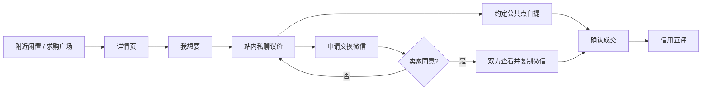

# 邻里集市：最终融合产品方案

版本：2026-08-14｜发布候选：`apps/codex-taro-app`

## 1. 产品定位

邻里集市不是“更小的闲鱼”，而是以真实小区为信任边界的同城闲置流转工具。它优先解决大件运费高、陌生人信任弱、临时需求没有响应和微信群信息沉底四个问题。

核心承诺：**附近、可信、当天可成交**。

### 一级入口原则

小程序第一层只强调“附近买卖闲置”：启动直接进入附近列表，首页仅保留“卖一件闲置”和“没找到？求购”两个动作，底部只保留“附近 / 卖闲置 / 消息”三项。地图、认证、信用、客服、个人中心和联系方式审批都在用户需要的上下文中出现，不与核心任务争抢首屏注意力。

- 附近：按真实定位展示“同小区 / 距你 800m”，默认只公开模糊距离和公共自提点。
- 可信：小区/楼栋认证、交易后互评、举报拉黑、内容审核。
- 高效：发布实拍、站内议价、约定自提；有必要时由卖家审批交换微信。
- 双向：既有闲置供给，也有求购广场承接反向需求。

## 2. 主闭环

联系方式不是商品公开字段。买家填写用途发起申请，卖家明确批准后才返回微信号；申请、批准、拒绝、撤回和举报均留痕。V1 不自动跳转微信、不抓取微信好友关系，也不公开手机号。

## 3. 页面与功能

| 模块 | 当前实现 | 正式上线补充 |
|---|---|---|
| 封面 | 品牌封面与闲置搜索分离 | 社区运营位、活动位 |
| 附近闲置 | 双列卡片、搜索筛选、距离、列表/地图切换、详情 | 云端分页、真实排序 |
| 发布闲置 | 相册/相机最多 9 图、完整名称价格、分类、描述、地图自提点、前置违禁词提示 | 图片上传、云端内容安全审核 |
| 求购广场 | 需求列表与发布求购 | 响应求购、到期管理 |
| 详情 | 实拍、价格、卖家认证、信用、距离、我想要 | 举报、收藏、成交状态 |
| 消息中心 | 会话列表、未读提示、提醒说明 | 云数据库会话、订阅消息模板 |
| 私聊 | 文本聊天、快捷议价/自提、联系方式审批演示 | 实时监听、图片消息、撤回与风控 |
| 我的 | 楼栋认证、信用标签、发布/求购入口、客服微信 | 真正认证流程、订单互评 |
| 地图 | MapContainer、MapPicker、NearbyMap、LocationTag | Key/AppID 白名单、真机压测 |

## 4. 技术架构

- 前端：React 18 + TypeScript + Vite 4 + Taro 4.2。
- 设计：组件级 SCSS Module + Design Tokens；Figma MCP 用于人机共同决策，不把整页截图当实现。
- 后端：微信 CloudBase 云函数与数据库；原生 WorkBuddy 工程保留七个既有云函数，并新增联系方式审批函数。
- 地图：腾讯位置服务；服务层集中封装逆地理编码、POI 搜索和距离计算。
- 安全：客户端即时拦截 + 云函数强制审核 + 管理端复核，客户端结果从不作为最终授权依据。

## 5. 与闲鱼相比的可持续优势

1. 以小区而不是全国流量为单位，供需半径更短，大件和低客单价物品也值得交易。
2. “楼栋认证 + 公共点自提 + 交易互评”形成邻里信任资产，而非单纯平台信用分。
3. 求购、免费赠送、邻里公告形成社区高频入口，降低只在卖东西时才打开的低频问题。
4. 站内沟通保留安全边界，需要时再经双方同意进入微信私域，兼顾转化和隐私。

## 6. 盈利模式

前 3 个月不抽交易佣金，优先做密度和成交。

1. **置顶与急售**：卖家按 3～10 元购买 24/72 小时社区置顶；免费赠送不收费。
2. **本地商家推广**：搬家、保洁、家电维修、旧物回收按社区投放，采用月费或有效线索计费。
3. **社区运营 SaaS**：向物业/社区运营方提供认证、公告、数据看板、纠纷工具，按小区年费收费。
4. **履约服务分成**：大件搬运、上门估价、环保回收产生服务佣金；平台不碰用户私下货款。
5. **品牌循环活动**：与商场、学校、企业园区合作“旧物周”，收取活动执行和赞助费。

北极星指标是“每个活跃小区每周成功自提数”；收入指标必须服从成交密度，避免早期付费墙伤害供给。

## 7. 增长方案

- 先打穿 1 个小区：群内每周固定“周末闲置日”，发布后生成小程序卡片回群。
- 楼栋种子用户：每栋招募 1 名主理人，完成认证和首批 5 件真实闲置。
- 供给激励：首次发布、免费赠送、成功邀请邻居获得置顶券，不直接发现金。
- 求购驱动回流：每天精选 3 条求购发到群，提醒“你家可能正好有”。
- 复制到邻近小区：以 3km 为单位开新社区，保持每个新社区先有 30～50 件供给再推广。

## 8. 发布边界

代码和构建产物可公开协作；微信正式上线仍需账号管理员完成人工动作：正式 AppID、CloudBase 环境、地图 Key 白名单、隐私协议、订阅消息模板、类目/主体资质、体验版真机测试和平台提审。详见《上线说明》。
